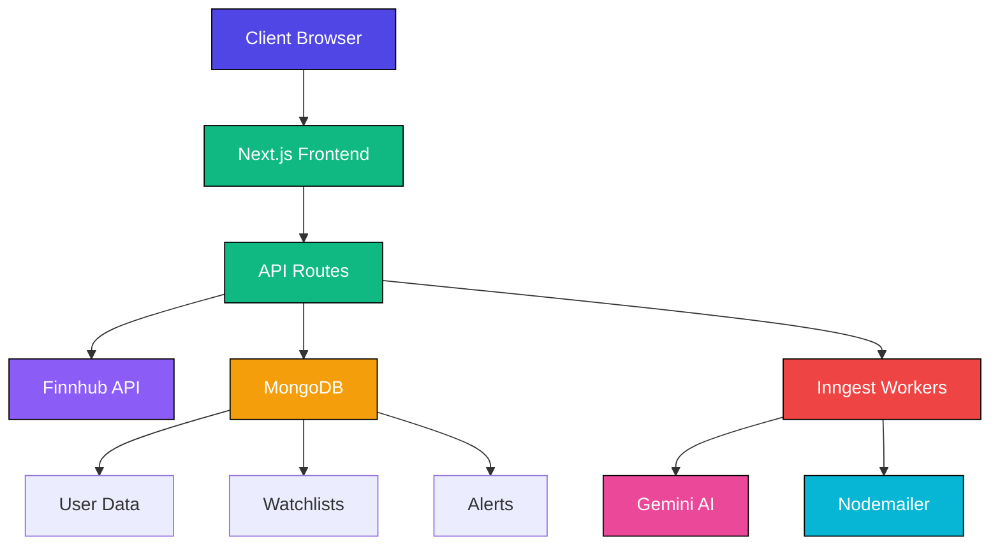
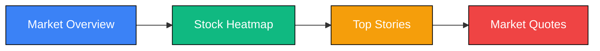
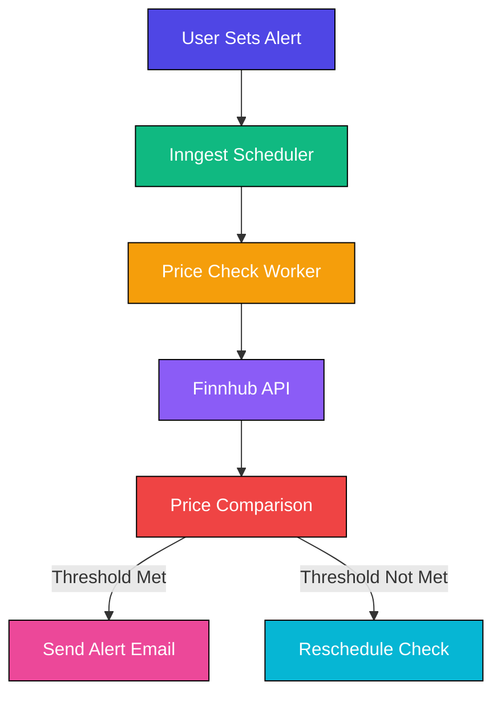
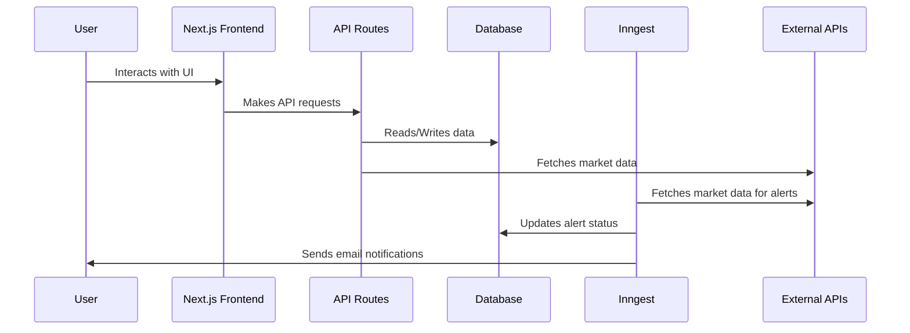

# Signalist - Real-Time Stock Market Tracking Platform

<div align="center">
  
</div>

<p align="center">
  <a href="https://github.com/your-username/signalist/stargazers">
    
  </a>
  <a href="https://github.com/your-username/signalist/issues">
    
  </a>
  <a href="https://github.com/your-username/signalist/blob/main/LICENSE">
    
  </a>
  <a href="https://nextjs.org/">
    
  </a>
  <a href="https://www.typescriptlang.org/">
    
  </a>
  <a href="https://reactjs.org/">
    
  </a>
  <a href="https://nodejs.org/">
    
  </a>
</p>

Signalist is a modern, real-time stock market tracking platform that provides investors and traders with comprehensive market data, personalized watchlists, and intelligent alerts. Built with cutting-edge technologies, it offers an intuitive interface for monitoring stock performance, analyzing market trends, and staying informed with the latest financial news.

## 🌟 Key Features

| Feature | Description |
|--------|-------------|
| **Real-Time Market Data** | Access live stock prices, market indices, and financial indicators |
| **Personalized Watchlists** | Create and manage custom watchlists for your favorite stocks |
| **Intelligent Alerts** | Set price alerts to get notified when stocks hit your target prices |
| **AI-Powered Insights** | Receive personalized market analysis and news summaries |
| **Comprehensive Charts** | Interactive TradingView charts for technical analysis |
| **Market News** | Stay updated with the latest financial news relevant to your portfolio |
| **User Authentication** | Secure sign-up and login with email verification |
| **Responsive Design** | Fully responsive interface that works on all devices |
| **Dark/Light Mode** | Toggle between dark and light themes based on preference |

## 🚀 Technology Stack

<div align="center">
  
</div>

### Frontend
- **[Next.js 15](https://nextjs.org/)** - React framework with App Router and Server Components
- **[TypeScript](https://www.typescriptlang.org/)** - Type-safe JavaScript for better code quality
- **[Tailwind CSS](https://tailwindcss.com/)** - Utility-first CSS framework for rapid UI development
- **[Radix UI](https://www.radix-ui.com/)** - Accessible and customizable UI primitives
- **[Lucide React](https://lucide.dev/)** - Beautiful and consistent SVG icons
- **[React Hook Form](https://react-hook-form.com/)** - Performant, flexible forms with easy validation
- **[Next Themes](https://github.com/pacocoursey/next-themes)** - Perfect dark mode implementation

### Backend & Services
- **[MongoDB](https://www.mongodb.com/)** - NoSQL database for flexible data storage
- **[Mongoose](https://mongoosejs.com/)** - MongoDB object modeling for Node.js
- **[Better Auth](https://www.better-auth.com/)** - Complete authentication solution with social login
- **[Inngest](https://www.inngest.com/)** - Event-driven background job processing
- **[Finnhub API](https://finnhub.io/)** - Real-time financial data and market news
- **[Gemini AI](https://ai.google.dev/)** - AI-powered insights and analysis
- **[Nodemailer](https://nodemailer.com/)** - Email delivery for notifications and alerts

## 🏗️ Architecture Overview



## 📊 System Components

### 1. Dashboard & Market Overview

<div align="center">
  
</div>

The dashboard provides a comprehensive overview of the financial markets with multiple widgets:



The dashboard features:

| Component | Functionality |
|----------|---------------|
| **Market Overview** | Real-time visualization of major market indices and sectors |
| **Stock Heatmap** | Color-coded representation of stock performance by sector |
| **Top Stories** | Latest financial news and market-moving events |
| **Market Quotes** | Detailed quotes for major stocks across different sectors |

### 2. Watchlist Management

<div align="center">
  
</div>

The watchlist system allows users to:

| Feature | Description |
|--------|-------------|
| **Add/Remove Stocks** | Easily add stocks to your watchlist with one click |
| **Real-Time Updates** | Watchlist prices update in real-time |
| **Custom Columns** | View price, change, market cap, P/E ratio, and more |
| **News Integration** | See relevant news for stocks in your watchlist |
| **Search Functionality** | Quick search for any stock symbol |
| **Persistent Storage** | Watchlists saved to your account |

### 3. Alert System

<div align="center">
  
</div>

The alert system provides automated notifications:



Alert features:

| Feature | Description |
|--------|-------------|
| **Price Thresholds** | Set upper/lower price alerts for stocks |
| **Email Notifications** | Receive email alerts when thresholds are met |
| **Smart Scheduling** | Automated price checking with Inngest workers |
| **Alert History** | Track sent alerts and their timestamps |
| **Custom Names** | Name your alerts for easy identification |

## 🛠️ Installation & Setup

### Prerequisites

- Node.js 18.x or higher
- MongoDB instance (local or cloud)
- API keys for required services

### Environment Variables

Create a `.env` file based on `.env.example`:

```bash
# Application
NEXT_PUBLIC_BASE_URL=http://localhost:3000
NODE_ENV=development

# Finnhub API
NEXT_PUBLIC_FINNHUB_API_KEY=your_finnhub_api_key
FINNHUB_BASE_URL=https://finnhub.io/api/v1

# MongoDB
MONGODB_URI=your_mongodb_connection_string

# Better Auth
BETTER_AUTH_SECRET=your_auth_secret
BETTER_AUTH_URL=http://localhost:3000

# Gemini AI
GEMINI_API_KEY=your_gemini_api_key

# Nodemailer
NODEMAILER_EMAIL=your_email
NODEMAILER_PASSWORD=your_email_password
```

### Installation Steps

1. Clone the repository:
   ```bash
   git clone https://github.com/your-username/signalist.git
   cd signalist
   ```

2. Install dependencies:
   ```bash
   npm install
   ```

3. Set up environment variables:
   ```bash
   cp .env.example .env
   # Edit .env with your credentials
   ```

4. Run the development server:
   ```bash
   npm run dev
   ```

5. Open [http://localhost:3000](http://localhost:3000) in your browser

### Database Setup

1. Create a MongoDB database
2. The application will automatically create collections:
   - `users` - User authentication data
   - `watchlists` - User watchlist items
   - `alerts` - Price alert configurations

## 📈 Data Flow Architecture



## 🧪 Testing

Run the test suite:

```bash
npm run test
```

Lint the code:

```bash
npm run lint
```

## 🚢 Deployment

### Vercel (Recommended)

1. Push your code to GitHub
2. Connect your repository to Vercel
3. Add environment variables in Vercel dashboard
4. Deploy!

### Docker Deployment

```bash
# Build the image
docker build -t signalist .

# Run the container
docker run -p 3000:3000 signalist
```

### Environment Configuration

For production deployment, ensure these environment variables are set:

| Variable | Description | Required |
|----------|-------------|----------|
| `NODE_ENV` | Environment (production/development) | Yes |
| `MONGODB_URI` | MongoDB connection string | Yes |
| `NEXT_PUBLIC_FINNHUB_API_KEY` | Finnhub API key | Yes |
| `BETTER_AUTH_SECRET` | Authentication secret | Yes |
| `GEMINI_API_KEY` | Gemini AI API key | Yes |
| `NODEMAILER_EMAIL` | Email for sending alerts | Yes |
| `NODEMAILER_PASSWORD` | Email password/app password | Yes |

## 📚 API Endpoints

| Endpoint | Method | Description |
|---------|--------|-------------|
| `/api/alerts` | GET | Fetch all alerts |
| `/api/inngest` | POST | Inngest webhook endpoint |
| `/api/trigger-alert` | POST | Manually trigger alerts |
| `/api/auth/*` | Various | Authentication endpoints |

## 🤝 Contributing

1. Fork the repository
2. Create your feature branch (`git checkout -b feature/AmazingFeature`)
3. Commit your changes (`git commit -m 'Add some AmazingFeature'`)
4. Push to the branch (`git push origin feature/AmazingFeature`)
5. Open a pull request

### Code Standards

- Follow TypeScript best practices
- Use ESLint for code formatting
- Write meaningful commit messages
- Include tests for new features
- Update documentation as needed

## 📄 License

This project is licensed under the MIT License - see the [LICENSE](LICENSE) file for details.

## 🙏 Acknowledgments

- [TradingView](https://www.tradingview.com/) for charting widgets
- [Finnhub](https://finnhub.io/) for financial data
- [Inngest](https://www.inngest.com/) for background job processing
- [Next.js](https://nextjs.org/) for the amazing framework
- [Tailwind CSS](https://tailwindcss.com/) for styling

## 📞 Support

If you encounter any issues or have questions, please [open an issue](https://github.com/your-username/signalist/issues) on GitHub.

<div align="center">
  
</div>

<p align="center">
  <a href="https://github.com/your-username/signalist/stargazers">
    
  </a>
  <a href="https://github.com/your-username/signalist/issues">
    
  </a>
  <a href="https://github.com/your-username/signalist/blob/main/LICENSE">
    
  </a>
  <a href="https://nextjs.org/">
    
  </a>
  <a href="https://www.typescriptlang.org/">
    
  </a>
  <a href="https://reactjs.org/">
    
  </a>
  <a href="https://nodejs.org/">
    
  </a>
</p>

Signalist is a modern, real-time stock market tracking platform that provides investors and traders with comprehensive market data, personalized watchlists, and intelligent alerts. Built with cutting-edge technologies, it offers an intuitive interface for monitoring stock performance, analyzing market trends, and staying informed with the latest financial news.

## 🌟 Key Features

| Feature | Description |
|--------|-------------|
| **Real-Time Market Data** | Access live stock prices, market indices, and financial indicators |
| **Personalized Watchlists** | Create and manage custom watchlists for your favorite stocks |
| **Intelligent Alerts** | Set price alerts to get notified when stocks hit your target prices |
| **AI-Powered Insights** | Receive personalized market analysis and news summaries |
| **Comprehensive Charts** | Interactive TradingView charts for technical analysis |
| **Market News** | Stay updated with the latest financial news relevant to your portfolio |

## 🚀 Technology Stack

<div align="center">
  
</div>

### Frontend
- **[Next.js 15](https://nextjs.org/)** - React framework with App Router
- **[TypeScript](https://www.typescriptlang.org/)** - Type-safe JavaScript
- **[Tailwind CSS](https://tailwindcss.com/)** - Utility-first CSS framework
- **[Radix UI](https://www.radix-ui.com/)** - Accessible UI components
- **[Lucide React](https://lucide.dev/)** - Beautiful SVG icons

### Backend & Services
- **[MongoDB](https://www.mongodb.com/)** - NoSQL database for user data
- **[Better Auth](https://www.better-auth.com/)** - Authentication system
- **[Inngest](https://www.inngest.com/)** - Background job processing
- **[Finnhub API](https://finnhub.io/)** - Real-time financial data
- **[Gemini AI](https://ai.google.dev/)** - AI-powered insights and analysis
- **[Nodemailer](https://nodemailer.com/)** - Email notifications

## 🏗️ Architecture Overview


## 📊 System Components


The dashboard provides a comprehensive overview of the financial markets with multiple widgets:


The watchlist system allows users to:

| Feature | Description |
|--------|-------------|
| **Add/Remove Stocks** | Easily add stocks to your watchlist with one click |
| **Real-Time Updates** | Watchlist prices update in real-time |
| **Custom Columns** | View price, change, market cap, P/E ratio, and more |
| **News Integration** | See relevant news for stocks in your watchlist |


The alert system provides automated notifications:


## 🛠️ Installation & Setup

### Prerequisites

- Node.js 18.x or higher
- MongoDB instance
- API keys for required services

### Environment Variables

Create a `.env` file based on `.env.example`:

```bash
# Application
NEXT_PUBLIC_BASE_URL=http://localhost:3000
NODE_ENV=development

# Finnhub API
NEXT_PUBLIC_FINNHUB_API_KEY=your_finnhub_api_key
FINNHUB_BASE_URL=https://finnhub.io/api/v1

# MongoDB
MONGODB_URI=your_mongodb_connection_string

# Better Auth
BETTER_AUTH_SECRET=your_auth_secret
BETTER_AUTH_URL=http://localhost:3000

# Gemini AI
GEMINI_API_KEY=your_gemini_api_key

# Nodemailer
NODEMAILER_EMAIL=your_email
NODEMAILER_PASSWORD=your_email_password
```

### Installation Steps

1. Clone the repository:
   ```bash
   git clone https://github.com/your-username/signalist.git
   cd signalist
   ```

2. Install dependencies:
   ```bash
   npm install
   ```

3. Set up environment variables:
   ```bash
   cp .env.example .env
   # Edit .env with your credentials
   ```

4. Run the development server:
   ```bash
   npm run dev
   ```

5. Open [http://localhost:3000](http://localhost:3000) in your browser

## 📈 Data Flow Architecture


## 🧪 Testing

Run the test suite:

```bash
npm run test
```

Lint the code:

```bash
npm run lint
```

## 🚢 Deployment

### Vercel (Recommended)

1. Push your code to GitHub
2. Connect your repository to Vercel
3. Add environment variables in Vercel dashboard
4. Deploy!

### Docker Deployment

```bash
# Build the image
docker build -t signalist .

# Run the container
docker run -p 3000:3000 signalist
```

## 📚 API Endpoints

| Endpoint | Method | Description |
|---------|--------|-------------|
| `/api/alerts` | GET | Fetch all alerts |
| `/api/inngest` | POST | Inngest webhook endpoint |
| `/api/trigger-alert` | POST | Manually trigger alerts |

## 🤝 Contributing

1. Fork the repository
2. Create your feature branch (`git checkout -b feature/AmazingFeature`)
3. Commit your changes (`git commit -m 'Add some AmazingFeature'`)
4. Push to the branch (`git push origin feature/AmazingFeature`)
5. Open a pull request

## 📄 License

This project is licensed under the MIT License - see the [LICENSE](LICENSE) file for details.

## 🙏 Acknowledgments

- [TradingView](https://www.tradingview.com/) for charting widgets
- [Finnhub](https://finnhub.io/) for financial data
- [Inngest](https://www.inngest.com/) for background job processing
- [Next.js](https://nextjs.org/) for the amazing framework
- [Tailwind CSS](https://tailwindcss.com/) for styling

## 📞 Support

If you encounter any issues or have questions, please [open an issue](https://github.com/your-username/signalist/issues) on GitHub.